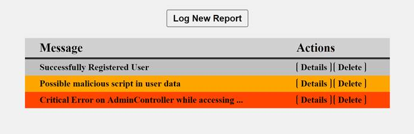
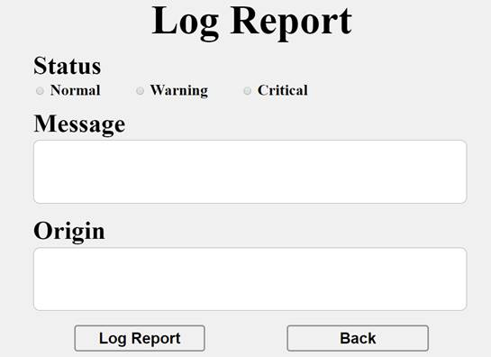
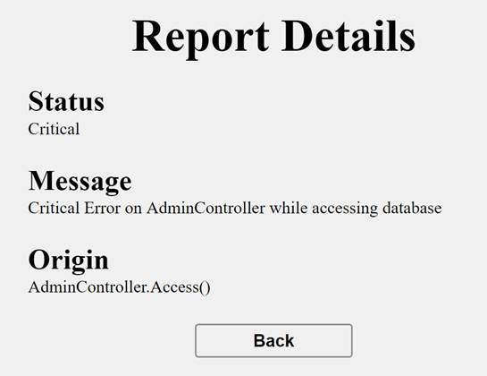
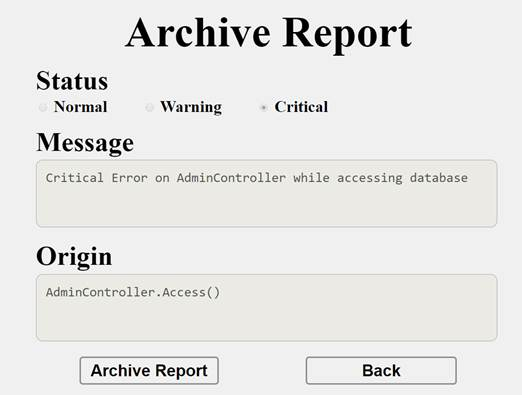

<html>

<head>
<meta http-equiv=Content-Type content="text/html; charset=windows-1251">
<meta name=Generator content="Microsoft Word 14 (filtered)">
<title>Software Technologies - Exam</title>

</head>

<body lang=EN-US link=blue vlink=purple>

<h1 align=center style='margin-top:0cm;text-align:center'>Practical Exam – Log
Noziroh</h1>

You have been tasked to create a simple application that
simulates a Log. The application should hold <b>reports</b>, which are the main
app <b>entities</b>. The app is called LogNoziroh.

The functionality of the application should support <b>creating</b>,
<b>listing, detailing</b>, <b>delete</b> reports.

The application should <b>persist</b> the data into a <b>database</b>.

<h2>Overview</h2>

Your application should be built on <b>each one </b>of the <b>following
technologies</b>:

<h3>PHP</h3>

·&nbsp;&nbsp;&nbsp;&nbsp;&nbsp;&nbsp;&nbsp;&nbsp;
<b>Symfony </b>framework

·&nbsp;&nbsp;&nbsp;&nbsp;&nbsp;&nbsp;&nbsp;&nbsp;
<b>Twig </b>view engine

·&nbsp;&nbsp;&nbsp;&nbsp;&nbsp;&nbsp;&nbsp;&nbsp;
<b>Doctrine</b> ORM

·&nbsp;&nbsp;&nbsp;&nbsp;&nbsp;&nbsp;&nbsp;&nbsp;
<b>MySQL </b>database

<h3>JavaScript</h3>

·&nbsp;&nbsp;&nbsp;&nbsp;&nbsp;&nbsp;&nbsp;&nbsp;
<b>NodeJS </b>+<b> ExpressJS </b>frameworks

·&nbsp;&nbsp;&nbsp;&nbsp;&nbsp;&nbsp;&nbsp;&nbsp;
<b>Handlebars.js </b>view engine

·&nbsp;&nbsp;&nbsp;&nbsp;&nbsp;&nbsp;&nbsp;&nbsp;
<b>Sequelize </b>

·&nbsp;&nbsp;&nbsp;&nbsp;&nbsp;&nbsp;&nbsp;&nbsp;
<b>MySQL </b>database

<h3>Java</h3>

·&nbsp;&nbsp;&nbsp;&nbsp;&nbsp;&nbsp;&nbsp;&nbsp;
<b>Spring </b>framework (<b>Spring MVC</b> + <b>Spring Boot</b> +
<b>Spring Data</b>)

·&nbsp;&nbsp;&nbsp;&nbsp;&nbsp;&nbsp;&nbsp;&nbsp;
<b>Thymeleaf </b>view engine

·&nbsp;&nbsp;&nbsp;&nbsp;&nbsp;&nbsp;&nbsp;&nbsp;
<b>JPA </b>/ <b>Hibernate ORM </b>+<b> Spring Data </b>data
access

·&nbsp;&nbsp;&nbsp;&nbsp;&nbsp;&nbsp;&nbsp;&nbsp;
<b>MySQL </b>database

<h3>C#</h3>

·&nbsp;&nbsp;&nbsp;&nbsp;&nbsp;&nbsp;&nbsp;&nbsp;
<b>ASP.NET Core framework (ASP.NET MVC + Entity Framework Core)</b>

·&nbsp;&nbsp;&nbsp;&nbsp;&nbsp;&nbsp;&nbsp;&nbsp;
<b>Razor view engine</b>

·&nbsp;&nbsp;&nbsp;&nbsp;&nbsp;&nbsp;&nbsp;&nbsp;
<b>Entity Framework Core ORM</b>

·&nbsp;&nbsp;&nbsp;&nbsp;&nbsp;&nbsp;&nbsp;&nbsp;
<b>MySQL database</b>

<h2>Data Model</h2>

The Report entity holds <b>5
properties</b>:

·&nbsp;&nbsp;&nbsp;&nbsp;&nbsp;&nbsp;&nbsp;&nbsp;
id – technology-dependent identifier (ObjectID for JavaScript, int for all other technologies)

·&nbsp;&nbsp;&nbsp;&nbsp;&nbsp;&nbsp;&nbsp;&nbsp;
status – non-empty text
(will either be “Normal”, “Warning” or “Critical”).

·&nbsp;&nbsp;&nbsp;&nbsp;&nbsp;&nbsp;&nbsp;&nbsp;
message – non-empty text

·&nbsp;&nbsp;&nbsp;&nbsp;&nbsp;&nbsp;&nbsp;&nbsp;
origin – non-empty text

<h2>Project Skeletons</h2>

<a name="_Hlk490473892">You will be given the applications’ </a>skeletons, which holds about <b>90%</b> of the logic.
You’ll be given some <b>files</b> (<b>controllers</b>, <b>models</b> etc.). The
files will have<b> partially implemented logic</b>, so you’ll need to write
some code for the application to <b>function properly</b>.

The application’s views will be given to you fully
implemented. You only need to include them in your business logic.

<b>Each technology</b> will have its <b>own skeleton</b>,
and the <b>different</b> <b>skeletons</b> may <b>differ</b> in <b>terms</b> of <b>what
is given to you</b> and <b>what is to be implemented</b>.

Everything that has been given to you inside the skeleton is
<b>correctly implemented </b>and if you write your code <b>correctly</b>, the
application should work just fine. You are free to change anything in the
Skeleton on your account.

<h2>User Interface</h2>

This is the user interface or how the application’s pages
should look in their final form (fully implemented). You have several pages,
described below:

<h3>Index Page</h3>

<h4>Route: “/”</h4>

Displays <b>all</b> the <b>products</b> from the database with<b>
options </b>to <b>view details about them</b> or <b>delete</b> them.

<h3>Create Page</h3>

<h4>Route: “/create”</h4>

<h3>Details Page</h3>

<h4>Route: “/details/{id}”</h4>

<h3>Delete Page</h3>

<h4>Route: “/delete/{id}”</h4>

<h2>Problem</h2>

As you can see the different pages are on different routes.
Most of the routing logic will be given to you in the <b>Skeleton</b>, but you
should make sure that the application <b>works properly</b>.

Implement the “<b>LogNoziroh” app</b> using all the above
described <b>4 technologies</b>.

<h2>Setup</h2>

Before you start working, make sure you <b>download all the
dependencies</b> (packages) required for each technology and <b>set up</b> the <b>databases</b>!
Below are instructions on how to do this:

<h3>PHP and Symfony</h3>

1.&nbsp;&nbsp;&nbsp;&nbsp;&nbsp;&nbsp; Go
into the <b>root directory</b> of the project (where the bin
folder resides)

2.&nbsp;&nbsp;&nbsp;&nbsp;&nbsp;&nbsp; Make
sure you’ve started your <b>MySQL server</b> (either from <b>XAMPP</b> or
standalone)

3.&nbsp;&nbsp;&nbsp;&nbsp;&nbsp;&nbsp; Open
a <b>shell</b> / <b>command prompt</b> /<b> PowerShell</b> window in the <b>root
directory</b>: [Shift] + [Right click] &egrave;
[Open command window here]

4.&nbsp;&nbsp;&nbsp;&nbsp;&nbsp;&nbsp; Enter
the “php composer.phar install” command to restore
its <b>Composer dependencies</b> (described in composer.json)

5.&nbsp;&nbsp;&nbsp;&nbsp;&nbsp;&nbsp; Enter
the “php bin/console doctrine:database:create
--if-not-exists” command

6.&nbsp;&nbsp;&nbsp;&nbsp;&nbsp;&nbsp; Done!

<h3>JavaScript and Node.js</h3>

1.&nbsp;&nbsp;&nbsp;&nbsp;&nbsp;&nbsp; Go
into the <b>root directory</b> of the project (where the bin
folder resides)

2.&nbsp;&nbsp;&nbsp;&nbsp;&nbsp;&nbsp; Create
a databse (name: <b>lognoziroh_js</b>)

3.&nbsp;&nbsp;&nbsp;&nbsp;&nbsp;&nbsp; Open
a <b>shell</b> / <b>command prompt</b> /<b> PowerShell</b> window in the <b>root
directory</b>: [Shift] + [Right click] &egrave;
[Open command window here]

4.&nbsp;&nbsp;&nbsp;&nbsp;&nbsp;&nbsp; Enter
the “npm install” command to restore its <b>Node.js
dependencies</b> (described in package.json)

5.&nbsp;&nbsp;&nbsp;&nbsp;&nbsp;&nbsp; Done!

<h3>C# and ASP.NET Core</h3>

The C# project will automatically resolve its <b>NuGet
dependencies</b> (described in packages.config)
using the NuGet package restore when the project is built.

<h3>Java and Spring MVC</h3>

The Java project will automatically resolve its <b>Maven
dependencies</b> (described in pom.xml) when the
project is built.

</body>

</html>
