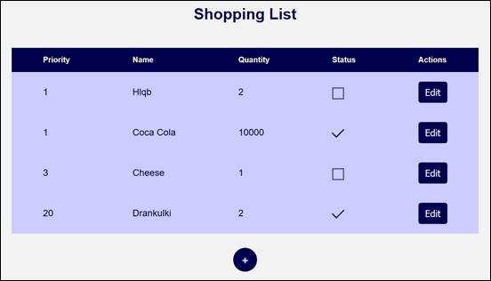

<html>

<head>
<meta http-equiv=Content-Type content="text/html; charset=windows-1251">
<meta name=Generator content="Microsoft Word 14 (filtered)">

</head>

<body lang=EN-US link=blue vlink=purple>

<h1 align=center style='margin-top:0cm;text-align:center'>Practical Exam –
Shopping List</h1>

You have been tasked to create a simple application that
simulates a Shopping List. The application should hold <b>products</b>, which
are the main app <b>entities</b>. The app is called ShoppingList.

The functionality of the application should support <b>creating</b>,
<b>listing</b>, <b>editing</b> products.

The application should <b>persist</b> the data into a <b>database</b>.

<h2>Overview</h2>

Your application should be built on <b>each one </b>of the <b>following
technologies</b>:

<h3>PHP</h3>

·&nbsp;&nbsp;&nbsp;&nbsp;&nbsp;&nbsp;&nbsp;&nbsp;
<b>Symfony </b>framework

·&nbsp;&nbsp;&nbsp;&nbsp;&nbsp;&nbsp;&nbsp;&nbsp;
<b>Twig </b>view engine

·&nbsp;&nbsp;&nbsp;&nbsp;&nbsp;&nbsp;&nbsp;&nbsp;
<b>Doctrine</b> ORM

·&nbsp;&nbsp;&nbsp;&nbsp;&nbsp;&nbsp;&nbsp;&nbsp;
<b>MySQL </b>database

<h3>JavaScript</h3>

·&nbsp;&nbsp;&nbsp;&nbsp;&nbsp;&nbsp;&nbsp;&nbsp;
<b>NodeJS </b>+<b> ExpressJS </b>frameworks

·&nbsp;&nbsp;&nbsp;&nbsp;&nbsp;&nbsp;&nbsp;&nbsp;
<b>Handlebars.js </b>view engine

·&nbsp;&nbsp;&nbsp;&nbsp;&nbsp;&nbsp;&nbsp;&nbsp;
<b>Sequelize ORM</b>

·&nbsp;&nbsp;&nbsp;&nbsp;&nbsp;&nbsp;&nbsp;&nbsp;
<b>MySQL </b>database

<h3>Java</h3>

·&nbsp;&nbsp;&nbsp;&nbsp;&nbsp;&nbsp;&nbsp;&nbsp;
<b>Spring </b>framework (<b>Spring MVC</b> + <b>Spring Boot</b> +
<b>Spring Data</b>)

·&nbsp;&nbsp;&nbsp;&nbsp;&nbsp;&nbsp;&nbsp;&nbsp;
<b>Thymeleaf </b>view engine

·&nbsp;&nbsp;&nbsp;&nbsp;&nbsp;&nbsp;&nbsp;&nbsp;
<b>JPA </b>/ <b>Hibernate ORM </b>+<b> Spring Data </b>data
access

·&nbsp;&nbsp;&nbsp;&nbsp;&nbsp;&nbsp;&nbsp;&nbsp;
<b>MySQL </b>database

<h3>C#</h3>

·&nbsp;&nbsp;&nbsp;&nbsp;&nbsp;&nbsp;&nbsp;&nbsp;
<b>ASP.NET </b>framework (<b>ASP.NET MVC</b> + <b>Entity
Framework Core</b>)

·&nbsp;&nbsp;&nbsp;&nbsp;&nbsp;&nbsp;&nbsp;&nbsp;
<b>Razor </b>view engine

·&nbsp;&nbsp;&nbsp;&nbsp;&nbsp;&nbsp;&nbsp;&nbsp;
<b>Entity Framework Core </b>ORM

·&nbsp;&nbsp;&nbsp;&nbsp;&nbsp;&nbsp;&nbsp;&nbsp;
<b>MySQL </b>database

<h2>Data Model</h2>

The Product entity holds <b>5
properties</b>:

·&nbsp;&nbsp;&nbsp;&nbsp;&nbsp;&nbsp;&nbsp;&nbsp;
id – technology-dependent identifier (ObjectID for JavaScript, int for all other technologies)

·&nbsp;&nbsp;&nbsp;&nbsp;&nbsp;&nbsp;&nbsp;&nbsp;
priority – non-null
integer

·&nbsp;&nbsp;&nbsp;&nbsp;&nbsp;&nbsp;&nbsp;&nbsp;
name – non-empty text

·&nbsp;&nbsp;&nbsp;&nbsp;&nbsp;&nbsp;&nbsp;&nbsp;
quantity – non-null
integer

·&nbsp;&nbsp;&nbsp;&nbsp;&nbsp;&nbsp;&nbsp;&nbsp;
status – non-empty text
(will either be “bought” or “not
bought”).

<h2>Project Skeletons</h2>

<a name="_Hlk490473892">You will be given the applications’ </a>skeletons, which holds about <b>90%</b> of the logic.
You’ll be given some <b>files</b> (<b>controllers</b>, <b>models</b> etc.). The
files will have<b> partially implemented logic</b>, so you’ll need to write
some code for the application to <b>function properly</b>.

The application’s views will be given to you fully
implemented. You only need to include them in your business logic.

<b>Each technology</b> will have its <b>own skeleton</b>,
and the <b>different</b> <b>skeletons</b> may <b>differ</b> in <b>terms</b> of <b>what
is given to you</b> and <b>what is to be implemented</b>.

Everything that has been given to you inside the skeleton is
<b>correctly implemented </b>and if you write your code <b>correctly</b>, the
application should work just fine. You are free to change anything in the
Skeleton on your account.

<h2>User Interface</h2>

This is the user interface or how the application’s pages
should look in their final form (fully implemented). You have several pages,
described below:

<h3>Index Page</h3>

<h4>Route: “/”</h4>

Displays <b>all</b> the <b>products</b> from the database with<b>
an option </b>to <b>modify</b> them.

&nbsp;

&nbsp;

&nbsp;

&nbsp;

&nbsp;

&nbsp;

&nbsp;

&nbsp;

&nbsp;

<h3>Create Page</h3>

<h4>Route: “/create”</h4>

<h3>Edit Page</h3>

<h4>Route: “/edit/{id}”</h4>

          

&nbsp;

<h2>Problem</h2>

As you can see the different pages are on different routes.
Most of the routing logic will be given to you in the <b>Skeleton</b>, but you
should make sure that the application <b>works properly</b>.

Implement the “<b>ShoppingList” app</b> using all the above
described <b>4 technologies</b>.

&nbsp;

</body>

</html>
