<html>

<head>
<meta http-equiv=Content-Type content="text/html; charset=windows-1251">
<meta name=Generator content="Microsoft Word 14 (filtered)">
<title>Exercises and Homework for Software Technologies Course at SoftUni</title>

</head>

<body lang=EN-US link=blue vlink=purple>

<h1>Exercises: PHP Syntax, Basic Web</h1>

Problems for exercises and homework for the <a
href="https://softuni.bg/courses/software-technologies">“Software Technologies”
course @ SoftUni</a>.

You can submit your solutions here <a
href="https://judge.softuni.bg/Contests/236/PHP-First-Steps-Exercises">https://judge.softuni.bg/Contests/236/PHP-First-Steps-Exercises</a>.

<h1>Part I: Simple operations with PHP</h1>

Taking into account the nature of PHP we will receive input <b>not</b>
from the console, as in C# or Java, but from <b>forms</b>, which will be <b>rendered</b>
in the <b>browser</b>. 

Every task in judge will have a <b>skeleton</b>, which will
be an <b>HTML</b> skeleton of the form.

In each example, you will see new column named “<b>Parameter
name</b>”. Every parameter, which should be passed to your program, should be
received from input tag
with exactly the same name parameter. All of the
skeletons will be with the correct name parameters.
If you write your own HTML make sure you use the <b>same</b> <b>names</b>.

<h2>1.&nbsp;&nbsp; Multiply a
Number by 2</h2>

You are given a number num. Write
a PHP script that <b>multiplies</b> the <b>number by 2</b> and prints the
result. The input comes as a parameter named num.

<h3>Examples</h3>

<table class=MsoTableGrid border=1 cellspacing=0 cellpadding=0 width=379
 style='width:283.95pt;margin-left:4.25pt;border-collapse:collapse;border:none'>
 <tr>
  <td width=123 valign=top style='width:91.95pt;border:solid windowtext 1.0pt;
  background:#D9D9D9;padding:2.85pt 4.25pt 2.85pt 4.25pt'>
  
<b>Parameter name</b>

  </td>
  <td width=51 valign=top style='width:38.45pt;border:solid windowtext 1.0pt;
  border-left:none;background:#D9D9D9;padding:2.85pt 4.25pt 2.85pt 4.25pt'>
  
<b>Input</b>

  </td>
  <td width=62 valign=top style='width:46.8pt;border:solid windowtext 1.0pt;
  border-left:none;background:#D9D9D9;padding:2.85pt 4.25pt 2.85pt 4.25pt'>
  
<b>Output</b>

  </td>
  <td width=20 valign=top style='width:15.15pt;border:none;border-right:solid windowtext 1.0pt;
  padding:2.85pt 4.25pt 2.85pt 4.25pt'>
  
<b>&nbsp;</b>

  </td>
  <td width=60 valign=top style='width:44.8pt;border:solid windowtext 1.0pt;
  border-left:none;background:#D9D9D9;padding:2.85pt 4.25pt 2.85pt 4.25pt'>
  
<b>Input</b>

  </td>
  <td width=62 valign=top style='width:46.8pt;border:solid windowtext 1.0pt;
  border-left:none;background:#D9D9D9;padding:2.85pt 4.25pt 2.85pt 4.25pt'>
  
<b>Output</b>

  </td>
 </tr>
 <tr>
  <td width=123 valign=top style='width:91.95pt;border:solid windowtext 1.0pt;
  border-top:none;padding:2.85pt 4.25pt 2.85pt 4.25pt'>
  
num

  </td>
  <td width=51 valign=top style='width:38.45pt;border-top:none;border-left:
  none;border-bottom:solid windowtext 1.0pt;border-right:solid windowtext 1.0pt;
  padding:2.85pt 4.25pt 2.85pt 4.25pt'>
  
2

  </td>
  <td width=62 style='width:46.8pt;border-top:none;border-left:none;border-bottom:
  solid windowtext 1.0pt;border-right:solid windowtext 1.0pt;padding:2.85pt 4.25pt 2.85pt 4.25pt'>
  
4

  </td>
  <td width=20 valign=top style='width:15.15pt;border:none;border-right:solid windowtext 1.0pt;
  padding:2.85pt 4.25pt 2.85pt 4.25pt'>
  
&nbsp;

  </td>
  <td width=60 valign=top style='width:44.8pt;border-top:none;border-left:none;
  border-bottom:solid windowtext 1.0pt;border-right:solid windowtext 1.0pt;
  padding:2.85pt 4.25pt 2.85pt 4.25pt'>
  
3

  </td>
  <td width=62 valign=top style='width:46.8pt;border-top:none;border-left:none;
  border-bottom:solid windowtext 1.0pt;border-right:solid windowtext 1.0pt;
  padding:2.85pt 4.25pt 2.85pt 4.25pt'>
  
6

  </td>
 </tr>
</table>

You will be given a HTML form that submits the input data:

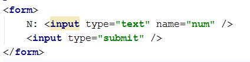

The name of the input parameter will be exactly as shown
above – num.

Print the output in the HTML document, just after the HTML
form.

<h3>Hints</h3>

·&nbsp;&nbsp;&nbsp;&nbsp;&nbsp;&nbsp;&nbsp;&nbsp;
In case the form was submitted and the input parameter num exists, take its value as integer using the function intval(string).

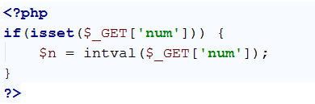

·&nbsp;&nbsp;&nbsp;&nbsp;&nbsp;&nbsp;&nbsp;&nbsp;
Then, just print the results: echo $n * 2.

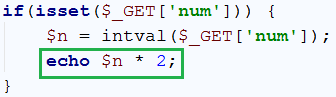

·&nbsp;&nbsp;&nbsp;&nbsp;&nbsp;&nbsp;&nbsp;&nbsp;
Test whether your code worked as expected:

&nbsp;

&nbsp;

&nbsp;

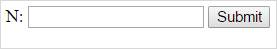

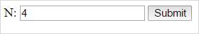

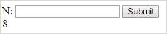

<h2>2.&nbsp;&nbsp; Multiply Two
Numbers</h2>

You are given a number num1 and
a number num2. Write a PHP script that multiplies num1 * num2 and prints the result. The input comes as
parameters named num1 and num2.
Print the output in the HTML page.

<h3>Examples</h3>

<table class=MsoTableGrid border=1 cellspacing=0 cellpadding=0 width=406
 style='width:304.8pt;margin-left:4.25pt;border-collapse:collapse;border:none'>
 <tr>
  <td width=128 valign=top style='width:96.35pt;border:solid windowtext 1.0pt;
  background:#D9D9D9;padding:2.85pt 4.25pt 2.85pt 4.25pt'>
  
<b>Parameters names</b>

  </td>
  <td width=61 valign=top style='width:45.85pt;border:solid windowtext 1.0pt;
  border-left:none;background:#D9D9D9;padding:2.85pt 4.25pt 2.85pt 4.25pt'>
  
<b>Input</b>

  </td>
  <td width=62 valign=top style='width:46.8pt;border:solid windowtext 1.0pt;
  border-left:none;background:#D9D9D9;padding:2.85pt 4.25pt 2.85pt 4.25pt'>
  
<b>Output</b>

  </td>
  <td width=22 rowspan=3 valign=top style='width:16.55pt;border:none;
  border-right:solid windowtext 1.0pt;background:white;padding:2.85pt 4.25pt 2.85pt 4.25pt'>
  
<b>&nbsp;</b>

  
&nbsp;

  
&nbsp;

  </td>
  <td width=66 valign=top style='width:49.6pt;border:solid windowtext 1.0pt;
  border-left:none;background:#D9D9D9;padding:2.85pt 4.25pt 2.85pt 4.25pt'>
  
<b>Input</b>

  </td>
  <td width=66 valign=top style='width:49.65pt;border:solid windowtext 1.0pt;
  border-left:none;background:#D9D9D9;padding:2.85pt 4.25pt 2.85pt 4.25pt'>
  
<b>Output</b>

  </td>
 </tr>
 <tr style='height:14.35pt'>
  <td width=128 style='width:96.35pt;border:solid windowtext 1.0pt;border-top:
  none;padding:2.85pt 4.25pt 2.85pt 4.25pt;height:14.35pt'>
  
num1

  </td>
  <td width=61 style='width:45.85pt;border-top:none;border-left:none;
  border-bottom:solid windowtext 1.0pt;border-right:solid windowtext 1.0pt;
  padding:2.85pt 4.25pt 2.85pt 4.25pt;height:14.35pt'>
  
2

  </td>
  <td width=62 rowspan=2 style='width:46.8pt;border-top:none;border-left:none;
  border-bottom:solid windowtext 1.0pt;border-right:solid windowtext 1.0pt;
  padding:2.85pt 4.25pt 2.85pt 4.25pt;height:14.35pt'>
  
6

  </td>
  <td width=66 style='width:49.6pt;border-top:none;border-left:none;border-bottom:
  solid windowtext 1.0pt;border-right:solid windowtext 1.0pt;padding:2.85pt 4.25pt 2.85pt 4.25pt;
  height:14.35pt'>
  
13

  </td>
  <td width=66 rowspan=2 style='width:49.65pt;border-top:none;border-left:none;
  border-bottom:solid windowtext 1.0pt;border-right:solid windowtext 1.0pt;
  padding:2.85pt 4.25pt 2.85pt 4.25pt;height:14.35pt'>
  
169

  </td>
 </tr>
 <tr style='height:1.0pt'>
  <td width=128 style='width:96.35pt;border:solid windowtext 1.0pt;border-top:
  none;padding:2.85pt 4.25pt 2.85pt 4.25pt;height:1.0pt'>
  
num2

  </td>
  <td width=61 style='width:45.85pt;border-top:none;border-left:none;
  border-bottom:solid windowtext 1.0pt;border-right:solid windowtext 1.0pt;
  padding:2.85pt 4.25pt 2.85pt 4.25pt;height:1.0pt'>
  
3

  </td>
  <td width=66 style='width:49.6pt;border-top:none;border-left:none;border-bottom:
  solid windowtext 1.0pt;border-right:solid windowtext 1.0pt;padding:2.85pt 4.25pt 2.85pt 4.25pt;
  height:1.0pt'>
  
13    

  </td>
 </tr>
</table>

<h3>Hints</h3>

·&nbsp;&nbsp;&nbsp;&nbsp;&nbsp;&nbsp;&nbsp;&nbsp;
This time the form which will be given to use will have 2
input elements, with names num1 and num2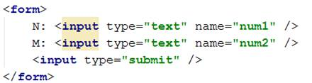

·&nbsp;&nbsp;&nbsp;&nbsp;&nbsp;&nbsp;&nbsp;&nbsp;
We must check both elements, if they have values before we
perform any action

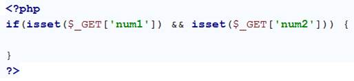

·&nbsp;&nbsp;&nbsp;&nbsp;&nbsp;&nbsp;&nbsp;&nbsp;
When we have checked both elements we get them both and extract
their values into variables and we perform the specified action:

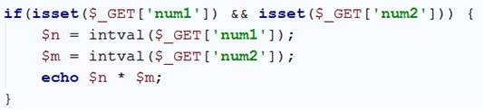

·&nbsp;&nbsp;&nbsp;&nbsp;&nbsp;&nbsp;&nbsp;&nbsp;
The result is as follows:

<h2>3.&nbsp;&nbsp; Multiply /
Divide Numbers</h2>

You are given a number num1 and
a number num2. Write a PHP script that:

·&nbsp;&nbsp;&nbsp;&nbsp;&nbsp;&nbsp;&nbsp;&nbsp;
Multiplies num1 *
num2 if num2 is greater
than or equal to num1.

·&nbsp;&nbsp;&nbsp;&nbsp;&nbsp;&nbsp;&nbsp;&nbsp;
Divides num1 / num2 if num1 is greater than num2.

The input comes as parameters named num1
and num2. Print the output in the HTML page.

<h3>Examples</h3>

<table class=MsoTableGrid border=1 cellspacing=0 cellpadding=0 width=536
 style='width:402.1pt;margin-left:4.25pt;border-collapse:collapse;border:none'>
 <tr>
  <td width=128 valign=top style='width:96.35pt;border:solid windowtext 1.0pt;
  background:#D9D9D9;padding:2.85pt 4.25pt 2.85pt 4.25pt'>
  
<b>Parameters names</b>

  </td>
  <td width=61 valign=top style='width:45.85pt;border:solid windowtext 1.0pt;
  border-left:none;background:#D9D9D9;padding:2.85pt 4.25pt 2.85pt 4.25pt'>
  
<b>Input</b>

  </td>
  <td width=62 valign=top style='width:46.8pt;border:solid windowtext 1.0pt;
  border-left:none;background:#D9D9D9;padding:2.85pt 4.25pt 2.85pt 4.25pt'>
  
<b>Output</b>

  </td>
  <td width=20 valign=top style='width:15.15pt;border:none;border-right:solid windowtext 1.0pt;
  padding:2.85pt 4.25pt 2.85pt 4.25pt'>
  
<b>&nbsp;</b>

  </td>
  <td width=60 valign=top style='width:44.8pt;border:solid windowtext 1.0pt;
  border-left:none;background:#D9D9D9;padding:2.85pt 4.25pt 2.85pt 4.25pt'>
  
<b>Input</b>

  </td>
  <td width=62 valign=top style='width:46.8pt;border:solid windowtext 1.0pt;
  border-left:none;background:#D9D9D9;padding:2.85pt 4.25pt 2.85pt 4.25pt'>
  
<b>Output</b>

  </td>
  <td width=20 rowspan=3 valign=top style='width:14.75pt;border:none;
  border-right:solid windowtext 1.0pt;padding:2.85pt 4.25pt 2.85pt 4.25pt'>
  
<b>&nbsp;</b>

  </td>
  <td width=60 valign=top style='width:44.8pt;border:solid windowtext 1.0pt;
  border-left:none;background:#D9D9D9;padding:2.85pt 4.25pt 2.85pt 4.25pt'>
  
<b>Input</b>

  </td>
  <td width=62 valign=top style='width:46.8pt;border:solid windowtext 1.0pt;
  border-left:none;background:#D9D9D9;padding:2.85pt 4.25pt 2.85pt 4.25pt'>
  
<b>Output</b>

  </td>
 </tr>
 <tr>
  <td width=128 style='width:96.35pt;border:solid windowtext 1.0pt;border-top:
  none;padding:2.85pt 4.25pt 2.85pt 4.25pt'>
  
num1

  </td>
  <td width=61 style='width:45.85pt;border-top:none;border-left:none;
  border-bottom:solid windowtext 1.0pt;border-right:solid windowtext 1.0pt;
  padding:2.85pt 4.25pt 2.85pt 4.25pt'>
  
2

  </td>
  <td width=62 rowspan=2 style='width:46.8pt;border-top:none;border-left:none;
  border-bottom:solid windowtext 1.0pt;border-right:solid windowtext 1.0pt;
  padding:2.85pt 4.25pt 2.85pt 4.25pt'>
  
6

  </td>
  <td width=20 style='width:15.15pt;border:none;border-right:solid windowtext 1.0pt;
  padding:2.85pt 4.25pt 2.85pt 4.25pt'>
  
&nbsp;

  </td>
  <td width=60 style='width:44.8pt;border-top:none;border-left:none;border-bottom:
  solid windowtext 1.0pt;border-right:solid windowtext 1.0pt;padding:2.85pt 4.25pt 2.85pt 4.25pt'>
  
13

  </td>
  <td width=62 rowspan=2 style='width:46.8pt;border-top:none;border-left:none;
  border-bottom:solid windowtext 1.0pt;border-right:solid windowtext 1.0pt;
  padding:2.85pt 4.25pt 2.85pt 4.25pt'>
  
169

  </td>
  <td width=60 style='width:44.8pt;border-top:none;border-left:none;border-bottom:
  solid windowtext 1.0pt;border-right:solid windowtext 1.0pt;padding:2.85pt 4.25pt 2.85pt 4.25pt'>
  
3

  </td>
  <td width=62 rowspan=2 style='width:46.8pt;border-top:none;border-left:none;
  border-bottom:solid windowtext 1.0pt;border-right:solid windowtext 1.0pt;
  padding:2.85pt 4.25pt 2.85pt 4.25pt'>
  
1.5

  </td>
 </tr>
 <tr>
  <td width=128 style='width:96.35pt;border:solid windowtext 1.0pt;border-top:
  none;padding:2.85pt 4.25pt 2.85pt 4.25pt'>
  
num2

  </td>
  <td width=61 style='width:45.85pt;border-top:none;border-left:none;
  border-bottom:solid windowtext 1.0pt;border-right:solid windowtext 1.0pt;
  padding:2.85pt 4.25pt 2.85pt 4.25pt'>
  
3

  </td>
  <td width=20 style='width:15.15pt;border:none;border-right:solid windowtext 1.0pt;
  padding:2.85pt 4.25pt 2.85pt 4.25pt'>
  
&nbsp;

  </td>
  <td width=60 style='width:44.8pt;border-top:none;border-left:none;border-bottom:
  solid windowtext 1.0pt;border-right:solid windowtext 1.0pt;padding:2.85pt 4.25pt 2.85pt 4.25pt'>
  
13

  </td>
  <td width=60 style='width:44.8pt;border-top:none;border-left:none;border-bottom:
  solid windowtext 1.0pt;border-right:solid windowtext 1.0pt;padding:2.85pt 4.25pt 2.85pt 4.25pt'>
  
2

  </td>
 </tr>
</table>

<h2>4.&nbsp;&nbsp; Product of
3 Numbers</h2>

You are given a number num1, num2 and num3. Write a PHP
script that finds if num1 * num2 * num3 (the
product) is <b>negative</b> or <b>positive</b>. Try to do this <b>WITHOUT</b>
multiplying the 3 numbers.

The input comes as parameters named num1,
num2 and num3.

<h3>Examples</h3>

<table class=MsoTableGrid border=1 cellspacing=0 cellpadding=0 width=576
 style='width:432.15pt;margin-left:4.25pt;border-collapse:collapse;border:none'>
 <tr style='height:1.0pt'>
  <td width=123 valign=top style='width:91.95pt;border:solid windowtext 1.0pt;
  background:#D9D9D9;padding:2.85pt 4.25pt 2.85pt 4.25pt;height:1.0pt'>
  
<b>Parameters name</b>

  </td>
  <td width=51 valign=top style='width:38.45pt;border:solid windowtext 1.0pt;
  border-left:none;background:#D9D9D9;padding:2.85pt 4.25pt 2.85pt 4.25pt;
  height:1.0pt'>
  
<b>Input</b>

  </td>
  <td width=84 valign=top style='width:62.95pt;border:solid windowtext 1.0pt;
  border-left:none;background:#D9D9D9;padding:2.85pt 4.25pt 2.85pt 4.25pt;
  height:1.0pt'>
  
<b>Output</b>

  </td>
  <td width=24 valign=top style='width:18.0pt;border:none;border-right:solid windowtext 1.0pt;
  padding:2.85pt 4.25pt 2.85pt 4.25pt;height:1.0pt'>
  
<b>&nbsp;</b>

  </td>
  <td width=51 valign=top style='width:38.45pt;border:solid windowtext 1.0pt;
  border-left:none;background:#D9D9D9;padding:2.85pt 4.25pt 2.85pt 4.25pt;
  height:1.0pt'>
  
<b>Input</b>

  </td>
  <td width=84 valign=top style='width:62.95pt;border:solid windowtext 1.0pt;
  border-left:none;background:#D9D9D9;padding:2.85pt 4.25pt 2.85pt 4.25pt;
  height:1.0pt'>
  
<b>Output</b>

  </td>
  <td width=24 rowspan=4 valign=top style='width:18.0pt;border:none;border-right:
  solid windowtext 1.0pt;padding:2.85pt 4.25pt 2.85pt 4.25pt;height:1.0pt'>
  
<b>&nbsp;</b>

  </td>
  <td width=51 valign=top style='width:38.45pt;border:solid windowtext 1.0pt;
  border-left:none;background:#D9D9D9;padding:2.85pt 4.25pt 2.85pt 4.25pt;
  height:1.0pt'>
  
<b>Input</b>

  </td>
  <td width=84 valign=top style='width:62.95pt;border:solid windowtext 1.0pt;
  border-left:none;background:#D9D9D9;padding:2.85pt 4.25pt 2.85pt 4.25pt;
  height:1.0pt'>
  
<b>Output</b>

  </td>
 </tr>
 <tr style='height:4.55pt'>
  <td width=123 valign=top style='width:91.95pt;border:solid windowtext 1.0pt;
  border-top:none;padding:2.85pt 4.25pt 2.85pt 4.25pt;height:4.55pt'>
  
num1

  </td>
  <td width=51 valign=top style='width:38.45pt;border-top:none;border-left:
  none;border-bottom:solid windowtext 1.0pt;border-right:solid windowtext 1.0pt;
  padding:2.85pt 4.25pt 2.85pt 4.25pt;height:4.55pt'>
  
2

  </td>
  <td width=84 rowspan=3 style='width:62.95pt;border-top:none;border-left:none;
  border-bottom:solid windowtext 1.0pt;border-right:solid windowtext 1.0pt;
  padding:2.85pt 4.25pt 2.85pt 4.25pt;height:4.55pt'>
  
Negative

  </td>
  <td width=24 valign=top style='width:18.0pt;border:none;border-right:solid windowtext 1.0pt;
  padding:2.85pt 4.25pt 2.85pt 4.25pt;height:4.55pt'>
  
&nbsp;

  </td>
  <td width=51 valign=top style='width:38.45pt;border-top:none;border-left:
  none;border-bottom:solid windowtext 1.0pt;border-right:solid windowtext 1.0pt;
  padding:2.85pt 4.25pt 2.85pt 4.25pt;height:4.55pt'>
  
5

  </td>
  <td width=84 rowspan=3 style='width:62.95pt;border-top:none;border-left:none;
  border-bottom:solid windowtext 1.0pt;border-right:solid windowtext 1.0pt;
  padding:2.85pt 4.25pt 2.85pt 4.25pt;height:4.55pt'>
  
Positive

  </td>
  <td width=51 valign=top style='width:38.45pt;border-top:none;border-left:
  none;border-bottom:solid windowtext 1.0pt;border-right:solid windowtext 1.0pt;
  padding:2.85pt 4.25pt 2.85pt 4.25pt;height:4.55pt'>
  
-3

  </td>
  <td width=84 rowspan=3 style='width:62.95pt;border-top:none;border-left:none;
  border-bottom:solid windowtext 1.0pt;border-right:solid windowtext 1.0pt;
  padding:2.85pt 4.25pt 2.85pt 4.25pt;height:4.55pt'>
  
Positive

  </td>
 </tr>
 <tr style='height:1.0pt'>
  <td width=123 valign=top style='width:91.95pt;border:solid windowtext 1.0pt;
  border-top:none;padding:2.85pt 4.25pt 2.85pt 4.25pt;height:1.0pt'>
  
num2

  </td>
  <td width=51 valign=top style='width:38.45pt;border-top:none;border-left:
  none;border-bottom:solid windowtext 1.0pt;border-right:solid windowtext 1.0pt;
  padding:2.85pt 4.25pt 2.85pt 4.25pt;height:1.0pt'>
  
3

  </td>
  <td width=24 valign=top style='width:18.0pt;border:none;border-right:solid windowtext 1.0pt;
  padding:2.85pt 4.25pt 2.85pt 4.25pt;height:1.0pt'>
  
&nbsp;

  </td>
  <td width=51 valign=top style='width:38.45pt;border-top:none;border-left:
  none;border-bottom:solid windowtext 1.0pt;border-right:solid windowtext 1.0pt;
  padding:2.85pt 4.25pt 2.85pt 4.25pt;height:1.0pt'>
  
4

  </td>
  <td width=51 valign=top style='width:38.45pt;border-top:none;border-left:
  none;border-bottom:solid windowtext 1.0pt;border-right:solid windowtext 1.0pt;
  padding:2.85pt 4.25pt 2.85pt 4.25pt;height:1.0pt'>
  
-4

  </td>
 </tr>
 <tr style='height:1.0pt'>
  <td width=123 valign=top style='width:91.95pt;border:solid windowtext 1.0pt;
  border-top:none;padding:2.85pt 4.25pt 2.85pt 4.25pt;height:1.0pt'>
  
num3

  </td>
  <td width=51 valign=top style='width:38.45pt;border-top:none;border-left:
  none;border-bottom:solid windowtext 1.0pt;border-right:solid windowtext 1.0pt;
  padding:2.85pt 4.25pt 2.85pt 4.25pt;height:1.0pt'>
  
-1

  </td>
  <td width=24 valign=top style='width:18.0pt;border:none;border-right:solid windowtext 1.0pt;
  padding:2.85pt 4.25pt 2.85pt 4.25pt;height:1.0pt'>
  
&nbsp;

  </td>
  <td width=51 valign=top style='width:38.45pt;border-top:none;border-left:
  none;border-bottom:solid windowtext 1.0pt;border-right:solid windowtext 1.0pt;
  padding:2.85pt 4.25pt 2.85pt 4.25pt;height:1.0pt'>
  
3

  </td>
  <td width=51 valign=top style='width:38.45pt;border-top:none;border-left:
  none;border-bottom:solid windowtext 1.0pt;border-right:solid windowtext 1.0pt;
  padding:2.85pt 4.25pt 2.85pt 4.25pt;height:1.0pt'>
  
5

  </td>
 </tr>
</table>

<h3>Hints</h3>

·&nbsp;&nbsp;&nbsp;&nbsp;&nbsp;&nbsp;&nbsp;&nbsp;
Count the <b>negative numbers</b>. If they are odd number, the
result will be negative, otherwise &agrave;
positive.

·&nbsp;&nbsp;&nbsp;&nbsp;&nbsp;&nbsp;&nbsp;&nbsp;
Special case: one of the numbers is 0 &agrave; the product is positive.

<h2>5.&nbsp;&nbsp; Numbers
from 1 to N</h2>

You are given a number num. Write
a PHP script that loops through all of the numbers from 1
to num and prints them. The input comes as a
parameter named num. The parameter num will hold a positive integer.

<h3>Examples</h3>

<table class=MsoTableGrid border=1 cellspacing=0 cellpadding=0 width=412
 style='width:309.2pt;margin-left:4.25pt;border-collapse:collapse;border:none'>
 <tr>
  <td width=117 valign=top style='width:87.6pt;border:solid windowtext 1.0pt;
  background:#D9D9D9;padding:2.85pt 4.25pt 2.85pt 4.25pt'>
  
<b>Parameter name</b>

  </td>
  <td width=61 valign=top style='width:45.85pt;border:solid windowtext 1.0pt;
  border-left:none;background:#D9D9D9;padding:2.85pt 4.25pt 2.85pt 4.25pt'>
  
<b>Input</b>

  </td>
  <td width=92 valign=top style='width:69.0pt;border:solid windowtext 1.0pt;
  border-left:none;background:#D9D9D9;padding:2.85pt 4.25pt 2.85pt 4.25pt'>
  
<b>Output</b>

  </td>
  <td width=20 valign=top style='width:15.15pt;border:none;border-right:solid windowtext 1.0pt;
  padding:2.85pt 4.25pt 2.85pt 4.25pt'>
  
<b>&nbsp;</b>

  </td>
  <td width=60 valign=top style='width:44.8pt;border:solid windowtext 1.0pt;
  border-left:none;background:#D9D9D9;padding:2.85pt 4.25pt 2.85pt 4.25pt'>
  
<b>Input</b>

  </td>
  <td width=62 valign=top style='width:46.8pt;border:solid windowtext 1.0pt;
  border-left:none;background:#D9D9D9;padding:2.85pt 4.25pt 2.85pt 4.25pt'>
  
<b>Output</b>

  </td>
 </tr>
 <tr>
  <td width=117 valign=top style='width:87.6pt;border:solid windowtext 1.0pt;
  border-top:none;padding:2.85pt 4.25pt 2.85pt 4.25pt'>
  
num

  </td>
  <td width=61 valign=top style='width:45.85pt;border-top:none;border-left:
  none;border-bottom:solid windowtext 1.0pt;border-right:solid windowtext 1.0pt;
  padding:2.85pt 4.25pt 2.85pt 4.25pt'>
  
5

  </td>
  <td width=92 style='width:69.0pt;border-top:none;border-left:none;border-bottom:
  solid windowtext 1.0pt;border-right:solid windowtext 1.0pt;padding:2.85pt 4.25pt 2.85pt 4.25pt'>
  
1 2 3 4 5

  </td>
  <td width=20 valign=top style='width:15.15pt;border:none;border-right:solid windowtext 1.0pt;
  padding:2.85pt 4.25pt 2.85pt 4.25pt'>
  
&nbsp;

  </td>
  <td width=60 valign=top style='width:44.8pt;border-top:none;border-left:none;
  border-bottom:solid windowtext 1.0pt;border-right:solid windowtext 1.0pt;
  padding:2.85pt 4.25pt 2.85pt 4.25pt'>
  
2

  </td>
  <td width=62 valign=top style='width:46.8pt;border-top:none;border-left:none;
  border-bottom:solid windowtext 1.0pt;border-right:solid windowtext 1.0pt;
  padding:2.85pt 4.25pt 2.85pt 4.25pt'>
  
1 2

  </td>
 </tr>
</table>

<h2>6.&nbsp;&nbsp; Numbers
from N to 1</h2>

You are given a number num. Write
a PHP script that loops through all of the numbers from num
to 1 and prints them. The input comes as a
parameter named num. The parameter num will hold a positive integer.

<h3>Examples</h3>

<table class=MsoTableGrid border=1 cellspacing=0 cellpadding=0 width=412
 style='width:309.2pt;margin-left:4.25pt;border-collapse:collapse;border:none'>
 <tr>
  <td width=117 valign=top style='width:87.6pt;border:solid windowtext 1.0pt;
  background:#D9D9D9;padding:2.85pt 4.25pt 2.85pt 4.25pt'>
  
<b>Parameter name</b>

  </td>
  <td width=61 valign=top style='width:45.85pt;border:solid windowtext 1.0pt;
  border-left:none;background:#D9D9D9;padding:2.85pt 4.25pt 2.85pt 4.25pt'>
  
<b>Input</b>

  </td>
  <td width=92 valign=top style='width:69.0pt;border:solid windowtext 1.0pt;
  border-left:none;background:#D9D9D9;padding:2.85pt 4.25pt 2.85pt 4.25pt'>
  
<b>Output</b>

  </td>
  <td width=20 valign=top style='width:15.15pt;border:none;border-right:solid windowtext 1.0pt;
  padding:2.85pt 4.25pt 2.85pt 4.25pt'>
  
<b>&nbsp;</b>

  </td>
  <td width=60 valign=top style='width:44.8pt;border:solid windowtext 1.0pt;
  border-left:none;background:#D9D9D9;padding:2.85pt 4.25pt 2.85pt 4.25pt'>
  
<b>Input</b>

  </td>
  <td width=62 valign=top style='width:46.8pt;border:solid windowtext 1.0pt;
  border-left:none;background:#D9D9D9;padding:2.85pt 4.25pt 2.85pt 4.25pt'>
  
<b>Output</b>

  </td>
 </tr>
 <tr>
  <td width=117 valign=top style='width:87.6pt;border:solid windowtext 1.0pt;
  border-top:none;padding:2.85pt 4.25pt 2.85pt 4.25pt'>
  
num

  </td>
  <td width=61 valign=top style='width:45.85pt;border-top:none;border-left:
  none;border-bottom:solid windowtext 1.0pt;border-right:solid windowtext 1.0pt;
  padding:2.85pt 4.25pt 2.85pt 4.25pt'>
  
5

  </td>
  <td width=92 style='width:69.0pt;border-top:none;border-left:none;border-bottom:
  solid windowtext 1.0pt;border-right:solid windowtext 1.0pt;padding:2.85pt 4.25pt 2.85pt 4.25pt'>
  
5 4 3 2 1

  </td>
  <td width=20 valign=top style='width:15.15pt;border:none;border-right:solid windowtext 1.0pt;
  padding:2.85pt 4.25pt 2.85pt 4.25pt'>
  
&nbsp;

  </td>
  <td width=60 valign=top style='width:44.8pt;border-top:none;border-left:none;
  border-bottom:solid windowtext 1.0pt;border-right:solid windowtext 1.0pt;
  padding:2.85pt 4.25pt 2.85pt 4.25pt'>
  
2

  </td>
  <td width=62 valign=top style='width:46.8pt;border-top:none;border-left:none;
  border-bottom:solid windowtext 1.0pt;border-right:solid windowtext 1.0pt;
  padding:2.85pt 4.25pt 2.85pt 4.25pt'>
  
2 1

  </td>
 </tr>
</table>

<h2>7.&nbsp;&nbsp; Even
Numbers from 1 to N</h2>

You are given a number num. Write
a PHP script that loops through all of the numbers from 1
to num and prints only the even ones. The input
comes as a parameter named num. The parameter num will hold a positive integer.

<h3>Examples</h3>

<table class=MsoTableGrid border=1 cellspacing=0 cellpadding=0 width=383
 style='width:287.0pt;margin-left:4.25pt;border-collapse:collapse;border:none'>
 <tr>
  <td width=117 valign=top style='width:87.6pt;border:solid windowtext 1.0pt;
  background:#D9D9D9;padding:2.85pt 4.25pt 2.85pt 4.25pt'>
  
<b>Parameter name</b>

  </td>
  <td width=61 valign=top style='width:45.85pt;border:solid windowtext 1.0pt;
  border-left:none;background:#D9D9D9;padding:2.85pt 4.25pt 2.85pt 4.25pt'>
  
<b>Input</b>

  </td>
  <td width=62 valign=top style='width:46.8pt;border:solid windowtext 1.0pt;
  border-left:none;background:#D9D9D9;padding:2.85pt 4.25pt 2.85pt 4.25pt'>
  
<b>Output</b>

  </td>
  <td width=20 valign=top style='width:15.15pt;border:none;border-right:solid windowtext 1.0pt;
  padding:2.85pt 4.25pt 2.85pt 4.25pt'>
  
<b>&nbsp;</b>

  </td>
  <td width=60 valign=top style='width:44.8pt;border:solid windowtext 1.0pt;
  border-left:none;background:#D9D9D9;padding:2.85pt 4.25pt 2.85pt 4.25pt'>
  
<b>Input</b>

  </td>
  <td width=62 valign=top style='width:46.8pt;border:solid windowtext 1.0pt;
  border-left:none;background:#D9D9D9;padding:2.85pt 4.25pt 2.85pt 4.25pt'>
  
<b>Output</b>

  </td>
 </tr>
 <tr>
  <td width=117 valign=top style='width:87.6pt;border:solid windowtext 1.0pt;
  border-top:none;padding:2.85pt 4.25pt 2.85pt 4.25pt'>
  
num

  </td>
  <td width=61 valign=top style='width:45.85pt;border-top:none;border-left:
  none;border-bottom:solid windowtext 1.0pt;border-right:solid windowtext 1.0pt;
  padding:2.85pt 4.25pt 2.85pt 4.25pt'>
  
5

  </td>
  <td width=62 style='width:46.8pt;border-top:none;border-left:none;border-bottom:
  solid windowtext 1.0pt;border-right:solid windowtext 1.0pt;padding:2.85pt 4.25pt 2.85pt 4.25pt'>
  
2 4

  </td>
  <td width=20 valign=top style='width:15.15pt;border:none;border-right:solid windowtext 1.0pt;
  padding:2.85pt 4.25pt 2.85pt 4.25pt'>
  
&nbsp;

  </td>
  <td width=60 valign=top style='width:44.8pt;border-top:none;border-left:none;
  border-bottom:solid windowtext 1.0pt;border-right:solid windowtext 1.0pt;
  padding:2.85pt 4.25pt 2.85pt 4.25pt'>
  
2

  </td>
  <td width=62 valign=top style='width:46.8pt;border-top:none;border-left:none;
  border-bottom:solid windowtext 1.0pt;border-right:solid windowtext 1.0pt;
  padding:2.85pt 4.25pt 2.85pt 4.25pt'>
  
2

  </td>
 </tr>
</table>

<h2>8.&nbsp;&nbsp; Odd
Numbers from N to 1</h2>

You are given a number num. Write
a PHP script that loops through all of the numbers from num
to 1 and prints only the odd ones. The input comes
as a parameter named num. The parameter num will hold a positive integer.

<h3>Examples</h3>

<table class=MsoTableGrid border=1 cellspacing=0 cellpadding=0 width=383
 style='width:287.0pt;margin-left:4.25pt;border-collapse:collapse;border:none'>
 <tr>
  <td width=117 valign=top style='width:87.6pt;border:solid windowtext 1.0pt;
  background:#D9D9D9;padding:2.85pt 4.25pt 2.85pt 4.25pt'>
  
<b>Parameter name</b>

  </td>
  <td width=61 valign=top style='width:45.85pt;border:solid windowtext 1.0pt;
  border-left:none;background:#D9D9D9;padding:2.85pt 4.25pt 2.85pt 4.25pt'>
  
<b>Input</b>

  </td>
  <td width=62 valign=top style='width:46.8pt;border:solid windowtext 1.0pt;
  border-left:none;background:#D9D9D9;padding:2.85pt 4.25pt 2.85pt 4.25pt'>
  
<b>Output</b>

  </td>
  <td width=20 valign=top style='width:15.15pt;border:none;border-right:solid windowtext 1.0pt;
  padding:2.85pt 4.25pt 2.85pt 4.25pt'>
  
<b>&nbsp;</b>

  </td>
  <td width=60 valign=top style='width:44.8pt;border:solid windowtext 1.0pt;
  border-left:none;background:#D9D9D9;padding:2.85pt 4.25pt 2.85pt 4.25pt'>
  
<b>Input</b>

  </td>
  <td width=62 valign=top style='width:46.8pt;border:solid windowtext 1.0pt;
  border-left:none;background:#D9D9D9;padding:2.85pt 4.25pt 2.85pt 4.25pt'>
  
<b>Output</b>

  </td>
 </tr>
 <tr>
  <td width=117 valign=top style='width:87.6pt;border:solid windowtext 1.0pt;
  border-top:none;padding:2.85pt 4.25pt 2.85pt 4.25pt'>
  
num

  </td>
  <td width=61 valign=top style='width:45.85pt;border-top:none;border-left:
  none;border-bottom:solid windowtext 1.0pt;border-right:solid windowtext 1.0pt;
  padding:2.85pt 4.25pt 2.85pt 4.25pt'>
  
5

  </td>
  <td width=62 style='width:46.8pt;border-top:none;border-left:none;border-bottom:
  solid windowtext 1.0pt;border-right:solid windowtext 1.0pt;padding:2.85pt 4.25pt 2.85pt 4.25pt'>
  
5 3 1

  </td>
  <td width=20 valign=top style='width:15.15pt;border:none;border-right:solid windowtext 1.0pt;
  padding:2.85pt 4.25pt 2.85pt 4.25pt'>
  
&nbsp;

  </td>
  <td width=60 valign=top style='width:44.8pt;border-top:none;border-left:none;
  border-bottom:solid windowtext 1.0pt;border-right:solid windowtext 1.0pt;
  padding:2.85pt 4.25pt 2.85pt 4.25pt'>
  
2

  </td>
  <td width=62 valign=top style='width:46.8pt;border-top:none;border-left:none;
  border-bottom:solid windowtext 1.0pt;border-right:solid windowtext 1.0pt;
  padding:2.85pt 4.25pt 2.85pt 4.25pt'>
  
1

  </td>
 </tr>
</table>

<h2>9.&nbsp;&nbsp; N Factorial</h2>

You are given a number num. Write
a PHP script that prints <b>factorial</b> of num.
Factorial is calculated by multiplying all numbers to the given number. Factorial
(N) = 1 * 2 * 3… * num. The input comes as a
parameter named num. The parameter num will hold a positive integer.

<h3>Examples</h3>

<table class=MsoTableGrid border=1 cellspacing=0 cellpadding=0 width=383
 style='width:287.0pt;margin-left:4.25pt;border-collapse:collapse;border:none'>
 <tr>
  <td width=117 valign=top style='width:87.6pt;border:solid windowtext 1.0pt;
  background:#D9D9D9;padding:2.85pt 4.25pt 2.85pt 4.25pt'>
  
<b>Parameter name</b>

  </td>
  <td width=61 valign=top style='width:45.85pt;border:solid windowtext 1.0pt;
  border-left:none;background:#D9D9D9;padding:2.85pt 4.25pt 2.85pt 4.25pt'>
  
<b>Input</b>

  </td>
  <td width=62 valign=top style='width:46.8pt;border:solid windowtext 1.0pt;
  border-left:none;background:#D9D9D9;padding:2.85pt 4.25pt 2.85pt 4.25pt'>
  
<b>Output</b>

  </td>
  <td width=20 valign=top style='width:15.15pt;border:none;border-right:solid windowtext 1.0pt;
  padding:2.85pt 4.25pt 2.85pt 4.25pt'>
  
<b>&nbsp;</b>

  </td>
  <td width=60 valign=top style='width:44.8pt;border:solid windowtext 1.0pt;
  border-left:none;background:#D9D9D9;padding:2.85pt 4.25pt 2.85pt 4.25pt'>
  
<b>Input</b>

  </td>
  <td width=62 valign=top style='width:46.8pt;border:solid windowtext 1.0pt;
  border-left:none;background:#D9D9D9;padding:2.85pt 4.25pt 2.85pt 4.25pt'>
  
<b>Output</b>

  </td>
 </tr>
 <tr>
  <td width=117 valign=top style='width:87.6pt;border:solid windowtext 1.0pt;
  border-top:none;padding:2.85pt 4.25pt 2.85pt 4.25pt'>
  
num

  </td>
  <td width=61 valign=top style='width:45.85pt;border-top:none;border-left:
  none;border-bottom:solid windowtext 1.0pt;border-right:solid windowtext 1.0pt;
  padding:2.85pt 4.25pt 2.85pt 4.25pt'>
  
5

  </td>
  <td width=62 style='width:46.8pt;border-top:none;border-left:none;border-bottom:
  solid windowtext 1.0pt;border-right:solid windowtext 1.0pt;padding:2.85pt 4.25pt 2.85pt 4.25pt'>
  
120

  </td>
  <td width=20 valign=top style='width:15.15pt;border:none;border-right:solid windowtext 1.0pt;
  padding:2.85pt 4.25pt 2.85pt 4.25pt'>
  
&nbsp;

  </td>
  <td width=60 valign=top style='width:44.8pt;border-top:none;border-left:none;
  border-bottom:solid windowtext 1.0pt;border-right:solid windowtext 1.0pt;
  padding:2.85pt 4.25pt 2.85pt 4.25pt'>
  
3

  </td>
  <td width=62 valign=top style='width:46.8pt;border-top:none;border-left:none;
  border-bottom:solid windowtext 1.0pt;border-right:solid windowtext 1.0pt;
  padding:2.85pt 4.25pt 2.85pt 4.25pt'>
  
6

  </td>
 </tr>
</table>

<h2>10.&nbsp;&nbsp;&nbsp;&nbsp;&nbsp;&nbsp;&nbsp;&nbsp;
Not Divisor Numbers</h2>

You are given a number num. Write
a PHP script that prints all the numbers from num
to 1<b>, </b>which are not divisors of num<b>.</b> The input comes as a parameter named num. The parameter num will
hold a positive integer.

<h3>Examples</h3>

<table class=MsoTableGrid border=1 cellspacing=0 cellpadding=0 width=490
 style='width:367.7pt;margin-left:4.25pt;border-collapse:collapse;border:none'>
 <tr>
  <td width=117 valign=top style='width:87.6pt;border:solid windowtext 1.0pt;
  background:#D9D9D9;padding:2.85pt 4.25pt 2.85pt 4.25pt'>
  
<b>Parameter name</b>

  </td>
  <td width=61 valign=top style='width:45.85pt;border:solid windowtext 1.0pt;
  border-left:none;background:#D9D9D9;padding:2.85pt 4.25pt 2.85pt 4.25pt'>
  
<b>Input</b>

  </td>
  <td width=108 valign=top style='width:81.1pt;border:solid windowtext 1.0pt;
  border-left:none;background:#D9D9D9;padding:2.85pt 4.25pt 2.85pt 4.25pt'>
  
<b>Output</b>

  </td>
  <td width=20 valign=top style='width:15.15pt;border:none;border-right:solid windowtext 1.0pt;
  padding:2.85pt 4.25pt 2.85pt 4.25pt'>
  
<b>&nbsp;</b>

  </td>
  <td width=60 valign=top style='width:44.8pt;border:solid windowtext 1.0pt;
  border-left:none;background:#D9D9D9;padding:2.85pt 4.25pt 2.85pt 4.25pt'>
  
<b>Input</b>

  </td>
  <td width=124 valign=top style='width:93.2pt;border:solid windowtext 1.0pt;
  border-left:none;background:#D9D9D9;padding:2.85pt 4.25pt 2.85pt 4.25pt'>
  
<b>Output</b>

  </td>
 </tr>
 <tr>
  <td width=117 valign=top style='width:87.6pt;border:solid windowtext 1.0pt;
  border-top:none;padding:2.85pt 4.25pt 2.85pt 4.25pt'>
  
num

  </td>
  <td width=61 valign=top style='width:45.85pt;border-top:none;border-left:
  none;border-bottom:solid windowtext 1.0pt;border-right:solid windowtext 1.0pt;
  padding:2.85pt 4.25pt 2.85pt 4.25pt'>
  
10

  </td>
  <td width=108 style='width:81.1pt;border-top:none;border-left:none;
  border-bottom:solid windowtext 1.0pt;border-right:solid windowtext 1.0pt;
  padding:2.85pt 4.25pt 2.85pt 4.25pt'>
  
9 8 7 6 4 3

  </td>
  <td width=20 valign=top style='width:15.15pt;border:none;border-right:solid windowtext 1.0pt;
  padding:2.85pt 4.25pt 2.85pt 4.25pt'>
  
&nbsp;

  </td>
  <td width=60 valign=top style='width:44.8pt;border-top:none;border-left:none;
  border-bottom:solid windowtext 1.0pt;border-right:solid windowtext 1.0pt;
  padding:2.85pt 4.25pt 2.85pt 4.25pt'>
  
12

  </td>
  <td width=124 valign=top style='width:93.2pt;border-top:none;border-left:
  none;border-bottom:solid windowtext 1.0pt;border-right:solid windowtext 1.0pt;
  padding:2.85pt 4.25pt 2.85pt 4.25pt'>
  
11 10 9 8 7 5

  </td>
 </tr>
</table>

<h2>11.&nbsp;&nbsp;&nbsp;&nbsp;&nbsp;&nbsp;&nbsp;&nbsp;
Fibonacci Sequence</h2>

You are given a number num. Write
a PHP script that prints<b> </b>num<b> </b>numbers
from The Fibonacci sequence, each on a new line, starting from 1. In the
Fibonacci sequence, every number is formed from the sum of the previous 2. The
input comes as a parameter named num. The parameter
num will hold a positive integer.

<h3>Examples</h3>

<table class=MsoTableGrid border=1 cellspacing=0 cellpadding=0 width=549
 style='width:411.8pt;margin-left:4.25pt;border-collapse:collapse;border:none'>
 <tr>
  <td width=117 valign=top style='width:87.6pt;border:solid windowtext 1.0pt;
  background:#D9D9D9;padding:2.85pt 4.25pt 2.85pt 4.25pt'>
  
<b>Parameter name</b>

  </td>
  <td width=61 valign=top style='width:45.85pt;border:solid windowtext 1.0pt;
  border-left:none;background:#D9D9D9;padding:2.85pt 4.25pt 2.85pt 4.25pt'>
  
<b>Input</b>

  </td>
  <td width=92 valign=top style='width:69.0pt;border:solid windowtext 1.0pt;
  border-left:none;background:#D9D9D9;padding:2.85pt 4.25pt 2.85pt 4.25pt'>
  
<b>Output</b>

  </td>
  <td width=15 valign=top style='width:10.9pt;border:none;border-right:solid windowtext 1.0pt;
  padding:2.85pt 4.25pt 2.85pt 4.25pt'>
  
<b>&nbsp;</b>

  </td>
  <td width=60 valign=top style='width:44.8pt;border:solid windowtext 1.0pt;
  border-left:none;background:#D9D9D9;padding:2.85pt 4.25pt 2.85pt 4.25pt'>
  
<b>Input</b>

  </td>
  <td width=205 valign=top style='width:153.65pt;border:solid windowtext 1.0pt;
  border-left:none;background:#D9D9D9;padding:2.85pt 4.25pt 2.85pt 4.25pt'>
  
<b>Output</b>

  </td>
 </tr>
 <tr>
  <td width=117 valign=top style='width:87.6pt;border:solid windowtext 1.0pt;
  border-top:none;padding:2.85pt 4.25pt 2.85pt 4.25pt'>
  
num

  </td>
  <td width=61 valign=top style='width:45.85pt;border-top:none;border-left:
  none;border-bottom:solid windowtext 1.0pt;border-right:solid windowtext 1.0pt;
  padding:2.85pt 4.25pt 2.85pt 4.25pt'>
  
5

  </td>
  <td width=92 valign=top style='width:69.0pt;border-top:none;border-left:none;
  border-bottom:solid windowtext 1.0pt;border-right:solid windowtext 1.0pt;
  padding:2.85pt 4.25pt 2.85pt 4.25pt'>
  
1 1 2 3 5

  </td>
  <td width=15 valign=top style='width:10.9pt;border:none;border-right:solid windowtext 1.0pt;
  padding:2.85pt 4.25pt 2.85pt 4.25pt'>
  
&nbsp;

  </td>
  <td width=60 valign=top style='width:44.8pt;border-top:none;border-left:none;
  border-bottom:solid windowtext 1.0pt;border-right:solid windowtext 1.0pt;
  padding:2.85pt 4.25pt 2.85pt 4.25pt'>
  
10

  </td>
  <td width=205 valign=top style='width:153.65pt;border-top:none;border-left:
  none;border-bottom:solid windowtext 1.0pt;border-right:solid windowtext 1.0pt;
  padding:2.85pt 4.25pt 2.85pt 4.25pt'>
  
1 1 2 3 5 8 13 21 34 55

  </td>
 </tr>
</table>

<h2>12.&nbsp;&nbsp;&nbsp;&nbsp;&nbsp;&nbsp;&nbsp;&nbsp;
Tribonacci Sequence</h2>

In the <b>“Tribonacci” sequence</b>, every number is formed
by the <b>sum of the previous 3</b>.

You are given a number num. Write
a PHP script that prints<b> </b>num<b> </b>numbers
from the Tribonacci sequence, each on a new line, starting from 1. The input
comes as a parameter named num. The value num will always be positive integer.

<h3>Examples</h3>

<table class=MsoTableGrid border=1 cellspacing=0 cellpadding=0 width=488
 style='width:366.35pt;margin-left:4.25pt;border-collapse:collapse;border:none'>
 <tr>
  <td width=117 valign=top style='width:87.6pt;border:solid windowtext 1.0pt;
  background:#D9D9D9;padding:2.85pt 4.25pt 2.85pt 4.25pt'>
  
<b>Parameter name</b>

  </td>
  <td width=51 valign=top style='width:38.45pt;border:solid windowtext 1.0pt;
  border-left:none;background:#D9D9D9;padding:2.85pt 4.25pt 2.85pt 4.25pt'>
  
<b>Input</b>

  </td>
  <td width=76 valign=top style='width:56.9pt;border:solid windowtext 1.0pt;
  border-left:none;background:#D9D9D9;padding:2.85pt 4.25pt 2.85pt 4.25pt'>
  
<b>Output</b>

  </td>
  <td width=20 valign=top style='width:15.15pt;border:none;border-right:solid windowtext 1.0pt;
  padding:2.85pt 4.25pt 2.85pt 4.25pt'>
  
<b>&nbsp;</b>

  </td>
  <td width=60 valign=top style='width:44.8pt;border:solid windowtext 1.0pt;
  border-left:none;background:#D9D9D9;padding:2.85pt 4.25pt 2.85pt 4.25pt'>
  
<b>Input</b>

  </td>
  <td width=165 valign=top style='width:123.45pt;border:solid windowtext 1.0pt;
  border-left:none;background:#D9D9D9;padding:2.85pt 4.25pt 2.85pt 4.25pt'>
  
<b>Output</b>

  </td>
 </tr>
 <tr>
  <td width=117 valign=top style='width:87.6pt;border:solid windowtext 1.0pt;
  border-top:none;padding:2.85pt 4.25pt 2.85pt 4.25pt'>
  
num

  </td>
  <td width=51 valign=top style='width:38.45pt;border-top:none;border-left:
  none;border-bottom:solid windowtext 1.0pt;border-right:solid windowtext 1.0pt;
  padding:2.85pt 4.25pt 2.85pt 4.25pt'>
  
4

  </td>
  <td width=76 valign=top style='width:56.9pt;border-top:none;border-left:none;
  border-bottom:solid windowtext 1.0pt;border-right:solid windowtext 1.0pt;
  padding:2.85pt 4.25pt 2.85pt 4.25pt'>
  
1 1 2 4

  
&nbsp;

  </td>
  <td width=20 valign=top style='width:15.15pt;border:none;border-right:solid windowtext 1.0pt;
  padding:2.85pt 4.25pt 2.85pt 4.25pt'>
  
&nbsp;

  </td>
  <td width=60 valign=top style='width:44.8pt;border-top:none;border-left:none;
  border-bottom:solid windowtext 1.0pt;border-right:solid windowtext 1.0pt;
  padding:2.85pt 4.25pt 2.85pt 4.25pt'>
  
8

  </td>
  <td width=165 valign=top style='width:123.45pt;border-top:none;border-left:
  none;border-bottom:solid windowtext 1.0pt;border-right:solid windowtext 1.0pt;
  padding:2.85pt 4.25pt 2.85pt 4.25pt'>
  
1 1 2 4 7 13 24 44

  </td>
 </tr>
</table>

<h2>13.&nbsp;&nbsp;&nbsp;&nbsp;&nbsp;&nbsp;&nbsp;&nbsp;
Prime Numbers from N to 1</h2>

You are given a number num. Write
a PHP script that prints<b> </b>only the <b>prime</b> numbers from num to 1. A prime number is a number that can be divided
only by 1 and itself. <b>1 is not a prime number.</b> The input comes as a
parameter named num. The parameter num will hold a positive integer.

<h3>Examples</h3>

<table class=MsoTableGrid border=1 cellspacing=0 cellpadding=0 width=506
 style='width:379.8pt;margin-left:4.25pt;border-collapse:collapse;border:none'>
 <tr>
  <td width=117 valign=top style='width:87.6pt;border:solid windowtext 1.0pt;
  background:#D9D9D9;padding:2.85pt 4.25pt 2.85pt 4.25pt'>
  
<b>Parameter name</b>

  </td>
  <td width=61 valign=top style='width:45.85pt;border:solid windowtext 1.0pt;
  border-left:none;background:#D9D9D9;padding:2.85pt 4.25pt 2.85pt 4.25pt'>
  
<b>Input</b>

  </td>
  <td width=76 valign=top style='width:56.9pt;border:solid windowtext 1.0pt;
  border-left:none;background:#D9D9D9;padding:2.85pt 4.25pt 2.85pt 4.25pt'>
  
<b>Output</b>

  </td>
  <td width=20 valign=top style='width:15.15pt;border:none;border-right:solid windowtext 1.0pt;
  padding:2.85pt 4.25pt 2.85pt 4.25pt'>
  
<b>&nbsp;</b>

  </td>
  <td width=60 valign=top style='width:44.8pt;border:solid windowtext 1.0pt;
  border-left:none;background:#D9D9D9;padding:2.85pt 4.25pt 2.85pt 4.25pt'>
  
<b>Input</b>

  </td>
  <td width=173 valign=top style='width:129.5pt;border:solid windowtext 1.0pt;
  border-left:none;background:#D9D9D9;padding:2.85pt 4.25pt 2.85pt 4.25pt'>
  
<b>Output</b>

  </td>
 </tr>
 <tr>
  <td width=117 valign=top style='width:87.6pt;border:solid windowtext 1.0pt;
  border-top:none;padding:2.85pt 4.25pt 2.85pt 4.25pt'>
  
Num

  </td>
  <td width=61 valign=top style='width:45.85pt;border-top:none;border-left:
  none;border-bottom:solid windowtext 1.0pt;border-right:solid windowtext 1.0pt;
  padding:2.85pt 4.25pt 2.85pt 4.25pt'>
  
10

  </td>
  <td width=76 valign=top style='width:56.9pt;border-top:none;border-left:none;
  border-bottom:solid windowtext 1.0pt;border-right:solid windowtext 1.0pt;
  padding:2.85pt 4.25pt 2.85pt 4.25pt'>
  
7 5 3 2

  </td>
  <td width=20 valign=top style='width:15.15pt;border:none;border-right:solid windowtext 1.0pt;
  padding:2.85pt 4.25pt 2.85pt 4.25pt'>
  
&nbsp;

  </td>
  <td width=60 valign=top style='width:44.8pt;border-top:none;border-left:none;
  border-bottom:solid windowtext 1.0pt;border-right:solid windowtext 1.0pt;
  padding:2.85pt 4.25pt 2.85pt 4.25pt'>
  
20

  </td>
  <td width=173 valign=top style='width:129.5pt;border-top:none;border-left:
  none;border-bottom:solid windowtext 1.0pt;border-right:solid windowtext 1.0pt;
  padding:2.85pt 4.25pt 2.85pt 4.25pt'>
  
19 17 13 11 7 5 3 2

  </td>
 </tr>
</table>

<h1>Part 2: Manipulating HTML with PHP</h1>

<h2>14.&nbsp;&nbsp;&nbsp;&nbsp;&nbsp;&nbsp;&nbsp;&nbsp;
HTML Buttons</h2>

You are given a number num. Write
a PHP script that <b>generates HTML &lt;button&gt; elements.</b> The buttons
must hold a number from 1 to num
as their caption. The input comes as a parameter named num,
holding a positive integer.

There is no indentation on the elements.

<h3>Examples</h3>

<table class=MsoTableGrid border=1 cellspacing=0 cellpadding=0 width=688
 style='width:515.95pt;margin-left:4.25pt;border-collapse:collapse;border:none'>
 <tr>
  <td width=117 valign=top style='width:87.6pt;border:solid windowtext 1.0pt;
  background:#D9D9D9;padding:2.85pt 4.25pt 2.85pt 4.25pt'>
  
<b>Parameter name</b>

  </td>
  <td width=61 valign=top style='width:45.85pt;border:solid windowtext 1.0pt;
  border-left:none;background:#D9D9D9;padding:2.85pt 4.25pt 2.85pt 4.25pt'>
  
<b>Input</b>

  </td>
  <td width=219 valign=top style='width:164.25pt;border:solid windowtext 1.0pt;
  border-left:none;background:#D9D9D9;padding:2.85pt 4.25pt 2.85pt 4.25pt'>
  
<b>Output</b>

  </td>
  <td width=291 valign=top style='width:218.25pt;border:solid windowtext 1.0pt;
  border-left:none;background:#D9D9D9;padding:2.85pt 4.25pt 2.85pt 4.25pt'>
  
<b>Picture</b>

  </td>
 </tr>
 <tr>
  <td width=117 valign=top style='width:87.6pt;border:solid windowtext 1.0pt;
  border-top:none;padding:2.85pt 4.25pt 2.85pt 4.25pt'>
  
num

  </td>
  <td width=61 valign=top style='width:45.85pt;border-top:none;border-left:
  none;border-bottom:solid windowtext 1.0pt;border-right:solid windowtext 1.0pt;
  padding:2.85pt 4.25pt 2.85pt 4.25pt'>
  
3

  </td>
  <td width=219 style='width:164.25pt;border-top:none;border-left:none;
  border-bottom:solid windowtext 1.0pt;border-right:solid windowtext 1.0pt;
  padding:2.85pt 4.25pt 2.85pt 4.25pt'>
  
&lt;button&gt;1&lt;/button&gt;

  
&lt;button&gt;2&lt;/button&gt;

  
&lt;button&gt;3&lt;/button&gt;

  </td>
  <td width=291 rowspan=3 style='width:218.25pt;border-top:none;border-left:
  none;border-bottom:solid windowtext 1.0pt;border-right:solid windowtext 1.0pt;
  padding:2.85pt 4.25pt 2.85pt 4.25pt'>
  
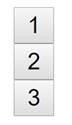

  </td>
 </tr>
 <tr>
  <td width=117 valign=top style='width:87.6pt;border:solid windowtext 1.0pt;
  border-top:none;padding:2.85pt 4.25pt 2.85pt 4.25pt'>
  
num

  </td>
  <td width=61 valign=top style='width:45.85pt;border-top:none;border-left:
  none;border-bottom:solid windowtext 1.0pt;border-right:solid windowtext 1.0pt;
  padding:2.85pt 4.25pt 2.85pt 4.25pt'>
  
5

  </td>
  <td width=219 style='width:164.25pt;border-top:none;border-left:none;
  border-bottom:solid windowtext 1.0pt;border-right:solid windowtext 1.0pt;
  padding:2.85pt 4.25pt 2.85pt 4.25pt'>
  
&lt;button&gt;1&lt;/button&gt;

  
&lt;button&gt;2&lt;/button&gt;

  
&lt;button&gt;3&lt;/button&gt;

  
&lt;button&gt;4&lt;/button&gt;

  
&lt;button&gt;5&lt;/button&gt;

  </td>
 </tr>
 <tr>
  <td width=117 valign=top style='width:87.6pt;border:solid windowtext 1.0pt;
  border-top:none;padding:2.85pt 4.25pt 2.85pt 4.25pt'>
  
num

  </td>
  <td width=61 valign=top style='width:45.85pt;border-top:none;border-left:
  none;border-bottom:solid windowtext 1.0pt;border-right:solid windowtext 1.0pt;
  padding:2.85pt 4.25pt 2.85pt 4.25pt'>
  
1

  </td>
  <td width=219 style='width:164.25pt;border-top:none;border-left:none;
  border-bottom:solid windowtext 1.0pt;border-right:solid windowtext 1.0pt;
  padding:2.85pt 4.25pt 2.85pt 4.25pt'>
  
&lt;button&gt;1&lt;/button&gt;

  </td>
 </tr>
</table>

<h2>15.&nbsp;&nbsp;&nbsp;&nbsp;&nbsp;&nbsp;&nbsp;&nbsp;
Sub-Lists</h2>

You are given a number num1 and
a number num2. Write a PHP script that generates a
list with <b>num1</b> elements, and each of those elements has a sub-list with <b>num2
</b>elements. Each of the Lists has a caption “<b>List #</b>” where #<b> </b>is
the current number from 1 to num1<b>.
</b>And each of the elements of those lists has a caption “<b>Element #.#</b>”
where the first # is the current list number and the second <b>#</b> is the
current element from 1 to num2.
The input comes as two parameters named num1 and num2, holding positive integers.

<h3>Examples</h3>

<table class=MsoTableGrid border=1 cellspacing=0 cellpadding=0 width=690
 style='width:517.4pt;margin-left:4.25pt;border-collapse:collapse;border:none'>
 <tr>
  <td width=128 valign=top style='width:96.35pt;border:solid windowtext 1.0pt;
  background:#D9D9D9;padding:2.85pt 4.25pt 2.85pt 4.25pt'>
  
<b>Parameters names</b>

  </td>
  <td width=51 valign=top style='width:38.45pt;border:solid windowtext 1.0pt;
  border-left:none;background:#D9D9D9;padding:2.85pt 4.25pt 2.85pt 4.25pt'>
  
<b>Input</b>

  </td>
  <td width=302 valign=top style='width:226.7pt;border:solid windowtext 1.0pt;
  border-left:none;background:#D9D9D9;padding:2.85pt 4.25pt 2.85pt 4.25pt'>
  
<b>Output</b>

  </td>
  <td width=208 valign=top style='width:155.9pt;border:solid windowtext 1.0pt;
  border-left:none;background:#D9D9D9;padding:2.85pt 4.25pt 2.85pt 4.25pt'>
  
<b>Picture</b>

  </td>
 </tr>
 <tr>
  <td width=128 valign=top style='width:96.35pt;border:solid windowtext 1.0pt;
  border-top:none;padding:2.85pt 4.25pt 2.85pt 4.25pt'>
  
num1

  </td>
  <td width=51 valign=top style='width:38.45pt;border-top:none;border-left:
  none;border-bottom:solid windowtext 1.0pt;border-right:solid windowtext 1.0pt;
  padding:2.85pt 4.25pt 2.85pt 4.25pt'>
  
1

  </td>
  <td width=302 rowspan=2 style='width:226.7pt;border-top:none;border-left:
  none;border-bottom:solid windowtext 1.0pt;border-right:solid windowtext 1.0pt;
  padding:2.85pt 4.25pt 2.85pt 4.25pt'>
  
&lt;ul&gt;

  
    &lt;li&gt;List 1

  
       &lt;ul&gt;

  
           &lt;li&gt;

  
               Element 1.1

  
           &lt;/li&gt;

  
           &lt;li&gt;

  
               Element 1.2

  
           &lt;/li&gt;

  
        &lt;/ul&gt;

  
    &lt;/li&gt;

  
&lt;/ul&gt;

  </td>
  <td width=208 rowspan=2 style='width:155.9pt;border-top:none;border-left:
  none;border-bottom:solid windowtext 1.0pt;border-right:solid windowtext 1.0pt;
  padding:2.85pt 4.25pt 2.85pt 4.25pt'>
  
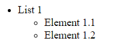

  </td>
 </tr>
 <tr>
  <td width=128 valign=top style='width:96.35pt;border:solid windowtext 1.0pt;
  border-top:none;padding:2.85pt 4.25pt 2.85pt 4.25pt'>
  
num2

  </td>
  <td width=51 valign=top style='width:38.45pt;border-top:none;border-left:
  none;border-bottom:solid windowtext 1.0pt;border-right:solid windowtext 1.0pt;
  padding:2.85pt 4.25pt 2.85pt 4.25pt'>
  
2

  </td>
 </tr>
</table>

There is <b>indentation</b> on the elements. Each nested
element is <b>tabbed</b> <b>once right</b> from its parent.

<h2>16.&nbsp;&nbsp;&nbsp;&nbsp;&nbsp;&nbsp;&nbsp;&nbsp;
Draw an “S” with Buttons</h2>

Write a PHP script that draws 5 x 9 &lt;button&gt;
elements with <b>0 </b>and <b>1</b> in them. The <b>1</b>s should form a figure
<b>“S”</b>. Make the <b>1</b>s’ background color – <b>blue</b>. There is no
indentation on the elements.

<h3>Example</h3>

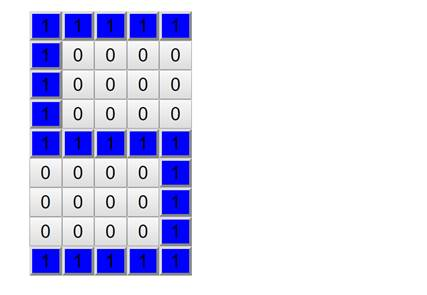

<h2>17.&nbsp;&nbsp;&nbsp;&nbsp;&nbsp;&nbsp;&nbsp;&nbsp;
RGB Table</h2>

Write a PHP script that draws a table with 3 columns, with
captions – <b>Red</b>, <b>Green</b> and <b>Blue</b>, and 5 rows, each having as
<b>background</b> <b>1</b> of <b>5</b> shades of those colors. Increase the
color index by <b>51</b> for each row. For example, for the Red Column it will
be:

·&nbsp;&nbsp;&nbsp;&nbsp;&nbsp;&nbsp;&nbsp;&nbsp;
RGB(51, 0, 0)

·&nbsp;&nbsp;&nbsp;&nbsp;&nbsp;&nbsp;&nbsp;&nbsp;
RGB(102, 0, 0)

·&nbsp;&nbsp;&nbsp;&nbsp;&nbsp;&nbsp;&nbsp;&nbsp;
RGB(153, 0, 0)

·&nbsp;&nbsp;&nbsp;&nbsp;&nbsp;&nbsp;&nbsp;&nbsp;
. . .

The caption columns should<b> NOT </b>be colored. Each cell
of the table has <b>width</b> and <b>height</b> equal to 50px
and has 1px <b>solid</b> <b>black</b> <b>border</b>.

<h3>Picture:</h3>

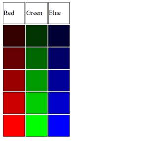

<h2>18.&nbsp;&nbsp;&nbsp;&nbsp;&nbsp;&nbsp;&nbsp;&nbsp;
50 Shades of Grey</h2>

Write a PHP script that generates 5 rows of 10 &lt;div&gt;<b> elements</b>, each having as background a
different shade of grey – resulting in 50 shades of grey. Every row starts with
a color index – a <b>multiple of 51</b>. 

·&nbsp;&nbsp;&nbsp;&nbsp;&nbsp;&nbsp;&nbsp;&nbsp;
First row – 0, 

·&nbsp;&nbsp;&nbsp;&nbsp;&nbsp;&nbsp;&nbsp;&nbsp;
Second row – 51, 

·&nbsp;&nbsp;&nbsp;&nbsp;&nbsp;&nbsp;&nbsp;&nbsp;
Third row – 102 … 

Then you need to print <b>10 divs</b>, each increasing that
index with <b>5.</b>

·&nbsp;&nbsp;&nbsp;&nbsp;&nbsp;&nbsp;&nbsp;&nbsp;
First row – 0, 5, 10…

·&nbsp;&nbsp;&nbsp;&nbsp;&nbsp;&nbsp;&nbsp;&nbsp;
Second row – 51, 56, 61…

The color index needs to be applied to <b>all</b> <b>parameters</b>
of the <b>RGB function</b>. Example: rgb(51, 51, 51);

<h3>Picture:</h3>

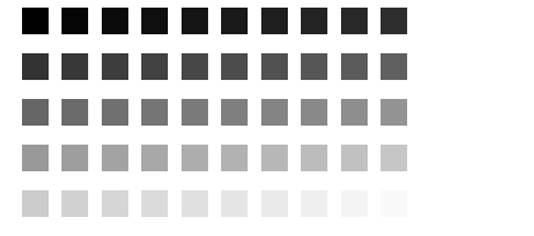

There is no indentation on the elements.

</body>

</html>
